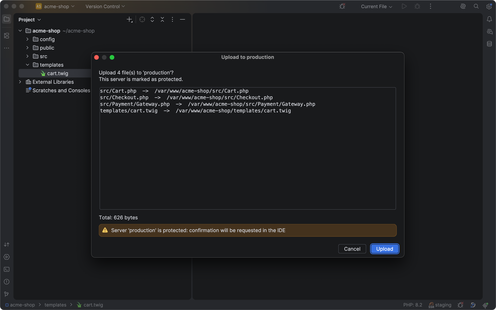
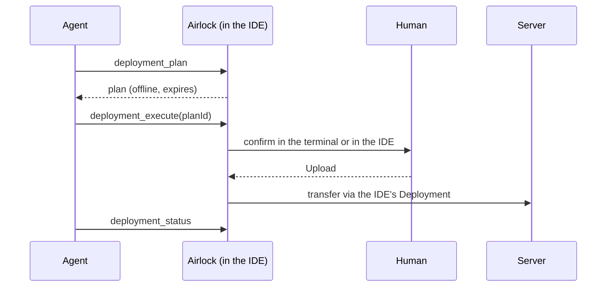
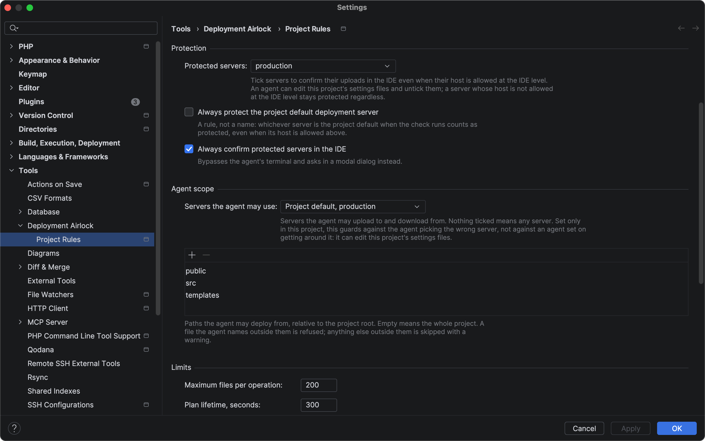
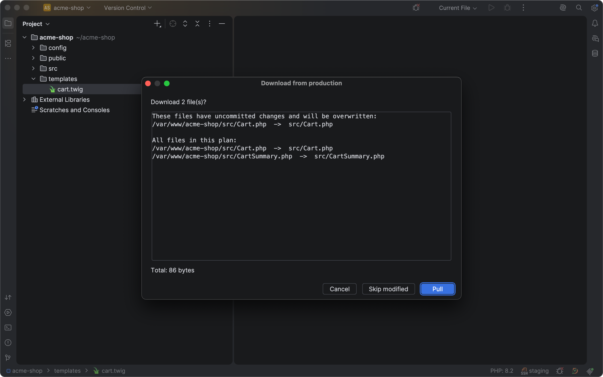
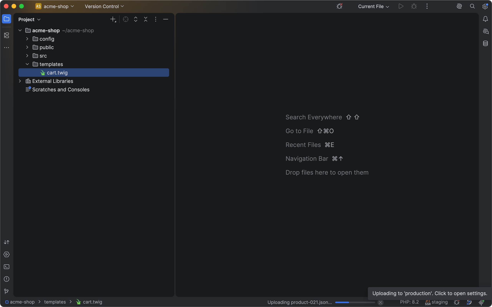
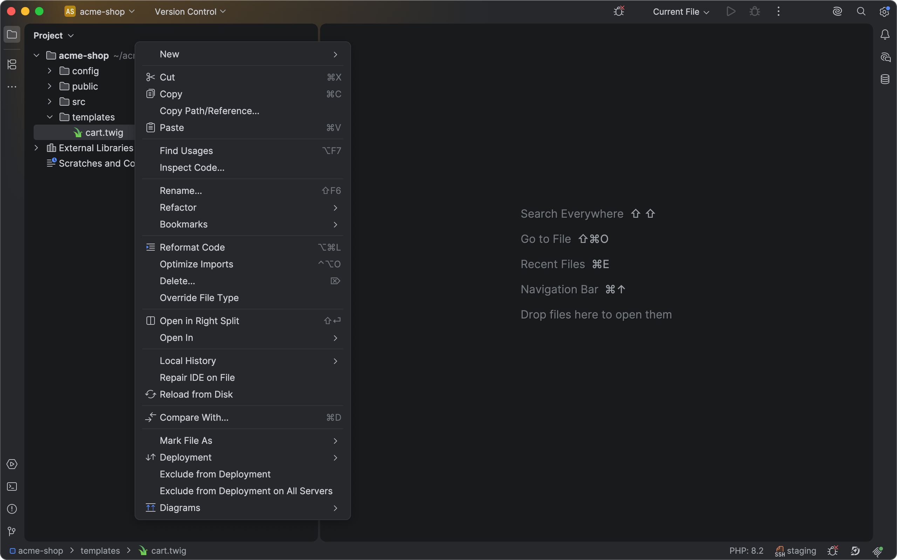

# Deployment Airlock

<!-- Plugin description -->
Guarded deployment for AI coding agents via the built-in JetBrains MCP server.

> An AI agent can ask. Only what a human allowed can leave. What will be transferred is fixed
> in advance, in writing, and expires.

A plugin for PhpStorm and WebStorm that adds deployment tools to the IDE's built-in MCP server.
Transfers run through the Deployment configurations already set up in the IDE, so the agent never
sees SSH keys, passwords or tokens, and no separate SFTP client is involved.

## What it guards against

- The plan is built offline, fixed in writing and expires; what was confirmed is what is sent —
  content fingerprints are checked again before the upload.
- Uploads are confirmed by a person, in a dialog inside the IDE that an agent cannot press. Only
  hosts you allow from that dialog, such as staging, may be confirmed in the agent's terminal
  instead; renaming a server or writing its IP address does not get around that.
- Three trust modes can lower that barrier — **Allow "don't ask again this session"**, **Never show
  the IDE dialog** and **Auto-approve, never ask**. All are off by default and live at the IDE level
  only, where an agent editing project files cannot switch them on. Even under **Auto-approve, never
  ask** the plan, the allowed paths, the file limit, the content fingerprints and the audit log still
  apply; only the confirmation is dropped.
- The agent can be limited to certain servers and certain directories of the project.
- Downloading from the server is off by default; uncommitted local work is never overwritten
  without a question, and `.idea`, `.git`, `.claude` and agent instruction files such as `CLAUDE.md`
  and `AGENTS.md` are never a download target.
- One operation per server at a time, and every transfer is written to an audit log.
- What it does not control is named: the IDE's own automatic upload and other MCP tools that can
  reach a server.

## MCP tools

| Tool                        | What it does                                                                                                                                               |
| --------------------------- | ---------------------------------------------------------------------------------------------------------------------------------------------------------- |
| `deployment_servers`        | Deployment servers configured for the project. Never credentials.                                                                                          |
| `deployment_plan`           | Immutable, expiring plan of local → remote paths. **Built entirely offline** — no connection, no credentials, nothing touched on the server.               |
| `deployment_execute`        | Uploads a plan, after the user confirms it. The caller cannot set confirmation.                                                                            |
| `deployment_status`         | State of a running operation — including which of the skipped files the IDE itself explained, and what that means for the copies on disk.                  |
| `deployment_remote_changes` | What changed **on the server**: compares the server's tree with the project and returns the comparison, which is itself the download plan. Off by default. |
| `deployment_pull`           | Downloads a plan built by `deployment_remote_changes`, after the user confirms it. Off by default.                                                         |

<!-- Plugin description end -->

## How it works

More: [protected servers](docs/guide/how-it-works.md#protected-servers),
[trust modes](docs/guide/how-it-works.md#trust-modes),
[path zone](docs/guide/how-it-works.md#the-agents-path-zone),
[downloads](docs/guide/how-it-works.md#downloading-from-the-server),
[what Airlock does not control](docs/guide/how-it-works.md#what-airlock-does-not-control).

## Quick start

1. [Turn on the IDE's MCP server](docs/guide/setup.md#turn-on-the-ides-mcp-server) in **Settings | Tools | MCP Server**; it is off by default.
2. [Set up a deployment server](docs/guide/setup.md#set-up-a-deployment-server) with mappings that cover the project, if there is none yet.
3. [Connect your client](docs/guide/setup.md#connect-your-client): press **Auto-Configure** next to it, then restart the client.
4. [Tell the agent](docs/guide/setup.md#tell-the-agent) that Airlock is the way to deploy, in the project's `AGENTS.md` or `CLAUDE.md`.
5. [Allow staging for the terminal](docs/guide/how-it-works.md#protected-servers): on the first upload to staging, tick the host checkbox in the IDE dialog. Never tick it for production.

## Gallery

| | |
| --- | --- |
|  Project rules: protected servers and the agent's scope |  Downloads never overwrite uncommitted work silently |
|  The status bar says what is in flight and whether the barrier is weakened |  Exclude a path from deployment from the Project view |

## Documentation

- [Setup](docs/guide/setup.md) — turning on the IDE's MCP server, a deployment server, connecting a client, telling the agent, troubleshooting.
- [Settings](docs/guide/settings.md) — every setting under its label in the IDE: default, range, and how the IDE and project levels merge.
- [How it works](docs/guide/how-it-works.md) — protected servers, trust modes, the path zone, downloads, the status widget, and what Airlock does not control.

## Requirements

- PhpStorm or WebStorm 2026.2 or later (`since-build 262`); the builds the verifier has actually
  run against are listed under Status
- The bundled `com.intellij.mcpServer` and `com.jetbrains.plugins.webDeployment` plugins,
  both enabled

## Status

Not yet released. The plugin is free; its source code is closed on purpose, and this repository
holds the documentation and the issue tracker.

All six tools — four for uploading, two for downloading — the offline plan with TTL / single-use /
content fingerprint, both confirmation channels, the trust modes, the path zone, settings on two
levels and the audit log are in place.

Verified: the unit suite is green; a UI suite runs against a live PhpStorm sandbox over Remote
Robot; an opt-in integration suite runs the transfer path against a real SFTP server; the manual
sandbox checklist — including the part no machine can check — has been walked through by a human;
and the Plugin Verifier reports `Compatible` against `PS-262.10315.130`, `PS-263.4732.41` and
`WS-262.10315.144` (WebStorm 2026.2.2). Its only notes are two deprecated-API usages that any
Kotlin class implementing `StatusBarWidget` gets.

WebStorm is verified by the Plugin Verifier only. Both bundled plugins Airlock depends on ship with
it, but the UI and integration suites run in PhpStorm.

Not done yet: the release itself. Version `1.0.0` is prepared but not yet published; before it goes
to the JetBrains Marketplace, the plugin is being tried on real projects.

## Reporting a problem

Bugs and questions go to [GitHub Issues](https://github.com/modxkit/deployment-airlock/issues).
Please include the IDE and its version (*Help | About*), the Airlock version, and the steps that led
to the problem. If a transfer went wrong, say which tool the agent called and what the dialog showed.

A way around the barrier is a vulnerability: report it privately, as [SECURITY.md](SECURITY.md)
describes, not in Issues.

## License

Free to use, closed source: the Deployment Airlock End User License Agreement — see
[LICENSE](LICENSE). It covers the plugin and this documentation.
