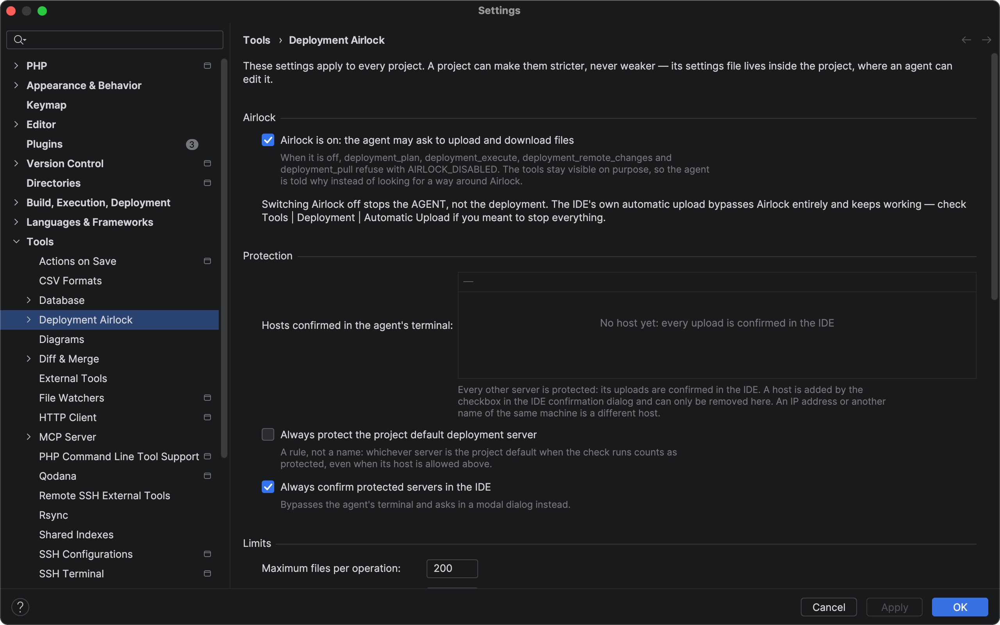
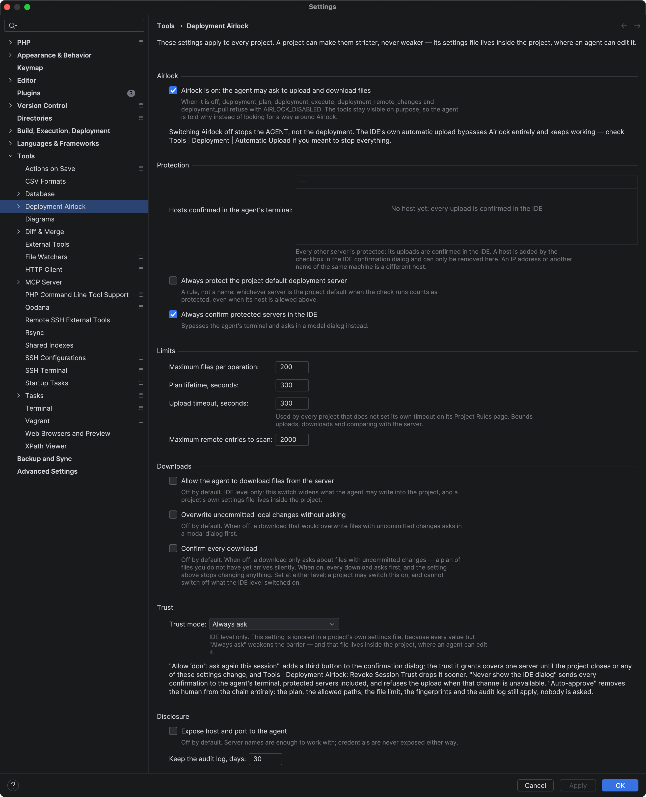
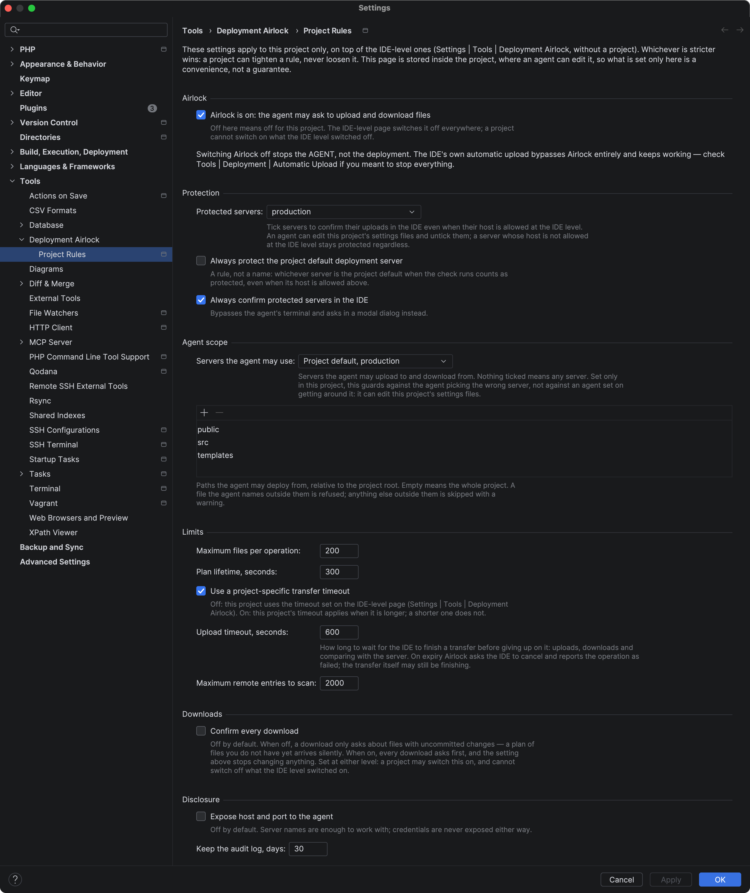

# Deployment Airlock settings

← Back to [Deployment Airlock](../../README.md)

Settings live at the IDE level (**Settings | Tools | Deployment Airlock**) and at the project level
(**… | Project Rules**, stored in `.idea/deployment-airlock.xml`).

The split is forced, not a convenience. The project's settings file sits inside the project, and
the platform picks up external edits to it — so every weakening a project file can express is a
weakening the agent can grant itself. The effective policy is therefore `strictest(app, project)`,
merged field by field, and the project level can only tighten.

This page lists every setting in the order the pages show them. For each one: the label as it
appears in the IDE, then its default, its range, the pages it is on and how the two levels merge.

## Where the settings are

| Page | Path | Applies to | Stored in |
| --- | --- | --- | --- |
| IDE level | **Settings \| Tools \| Deployment Airlock** | every project | `options/deployment-airlock-app.xml` in the IDE's configuration directory, outside any project |
| Project level | **Settings \| Tools \| Deployment Airlock \| Project Rules** | this project | `.idea/deployment-airlock.xml`, inside the project |

**The IDE-level page has no Protected servers and no Agent scope group.** Outside a project there is
no server list and no directory tree to pick from, so those settings exist on Project Rules only.

**Strictness set only in the project is a convenience, not a guarantee.** An agent can lift it by
rewriting `.idea/deployment-airlock.xml`; the guarantee is what the IDE level holds. That is why the
settings that weaken the barrier — the trust mode and the two download switches — exist at the IDE
level only.

## Airlock

**Airlock is on: the agent may ask to upload and download files**\
Default: on · Pages: both · Merge: AND — a project can switch it off, never on

When it is off, `deployment_plan`, `deployment_execute`, `deployment_remote_changes` and
`deployment_pull` refuse with `AIRLOCK_DISABLED`. The tools stay visible, so the agent is told why
instead of looking for another way. Switching Airlock off stops the agent, not the deployment: the
IDE's own automatic upload does not go through Airlock and keeps working.

## Protection

**Hosts confirmed in the agent's terminal:**\
Default: none · Pages: IDE level · Merge: none — only the IDE level is read

Every server whose host is not on this list is protected. A host is added by the checkbox in the
IDE confirmation dialog and removed here. An IP address or another name of the same machine is a
different host. The project page does not have this list: a project settings file is writable by an
agent, and a host allowed there would be a relaxation an agent grants itself. See
[Protected servers](how-it-works.md#protected-servers).

**Protected servers:**\
Default: none · Range: the project's deployment servers · Pages: Project Rules · Merge: union

A ticked server is confirmed in a dialog inside the IDE even when its host is allowed. Set only in
the project, the tick is a convenience: an agent can edit the project's settings file and untick
it. A ticked name that no longer matches any server is flagged on the page and reported to the
agent. See [Protected servers](how-it-works.md#protected-servers).

**Always protect the project default deployment server**\
Default: off · Pages: both · Merge: OR

A rule, not a stored name: whichever server is the project default when the check runs counts as
protected, even when its host is allowed. It follows the default server when that changes. It is off
by default because the empty host list already protects every server.

**Always confirm protected servers in the IDE**\
Default: on · Pages: both · Merge: OR

With it on, a protected server is confirmed in a modal dialog rather than in a form in the agent's
terminal. It concerns protected servers only; it does not put every server behind a dialog.

## Agent scope

**Servers the agent may use:**\
Default: nothing ticked, meaning any server · Range: the project's deployment servers · Pages:
Project Rules · Merge: each level's list applies — a server must be allowed by both

The servers the agent may upload to and download from. Any other one is refused with
`SERVER_NOT_ALLOWED`, and the message lists what is allowed. The first entry, **Project default server
(now: …)**, is a rule rather than a name: it follows the default chosen in Deployment settings.

**The list of paths under it** (its comment begins *Paths the agent may deploy from, relative to the
project root*)\
Default: empty, meaning the whole project · Range: the project's directories · Pages: Project Rules ·
Merge: intersection of the zones

A file the agent names outside these paths is refused with `PATH_NOT_ALLOWED`; a file collected by
`changed_files` outside them is skipped with a warning. See
[The agent's path zone](how-it-works.md#the-agents-path-zone).

## Limits

**Maximum files per operation:**\
Default: 200 · Range: 1–10 000 · Pages: both · Merge: min

A plan with more files is refused with `TOO_MANY_FILES`.

**Plan lifetime, seconds:**\
Default: 300 · Range: 30–3 600 · Pages: both · Merge: min

How long a plan stays valid. An expired plan cannot be executed; the agent has to build a new one.

**Use a project-specific transfer timeout**\
Default: off · Pages: Project Rules · Merge: off — the IDE-level timeout applies; on — this
project's does, but only when it is longer

The field below it is editable only while this is ticked.

**Upload timeout, seconds:**\
Default: 300 · Range: 30–7 200 · Pages: both · Merge: the IDE-level value, or the longer of the two
when the checkbox above is ticked

How long Airlock waits for the IDE to finish a transfer before giving up on it. Despite the label,
it bounds every transfer: uploads, downloads and comparing with the server. On expiry Airlock asks
the IDE to cancel and reports the operation as failed; the transfer itself may still be finishing,
so the server stays locked until the IDE restarts. The merge is not a minimum: the timeout is about
a project's network, not about safety, and a shorter one is not stricter. A project may only
lengthen it: a shorter timeout written into the project file protects nothing, yet fails honest
transfers and locks the server until the IDE restarts.

**Maximum remote entries to scan:**\
Default: 2 000 · Range: 1–100 000 · Pages: both · Merge: min

How many entries on the server `deployment_remote_changes` may walk in one call. Files and visited
directories count alike, so the limit can stop the walk with fewer files found than the number set.
When it does, the answer says the comparison is incomplete.

## Downloads

**Allow the agent to download files from the server**\
Default: off · Pages: IDE level only · Merge: IDE level only

While it is off, `deployment_remote_changes` and `deployment_pull` refuse with `PULL_DISABLED`. It
exists at the IDE level only because it widens what the agent may write into the project. See
[Downloading from the server](how-it-works.md#downloading-from-the-server).

**Overwrite uncommitted local changes without asking**\
Default: off · Pages: IDE level only · Merge: IDE level only

When off, a download that would overwrite files with uncommitted changes stops at a modal dialog
first.

**Confirm every download**\
Default: off · Pages: both · Merge: OR

When off, a download asks only about files with uncommitted changes, and a plan of files the project
does not have yet arrives silently. When on, every download asks first, and the setting above stops
changing anything. A project may switch it on, and cannot switch off what the IDE level switched on.

## Trust

**Trust mode:**\
Default: Always ask · Pages: IDE level only · Merge: IDE level only — a value in the project's file
is ignored

- **Always ask** — every upload is confirmed.
- **Allow "don't ask again this session"** — the confirmation dialog gets a third button that trusts
  one server until the project closes, any Airlock setting changes, or you revoke it.
- **Never show the IDE dialog** — every confirmation goes to the agent's terminal, protected servers
  included; if that channel is unavailable, or its answer is not a plain yes or no, the upload is
  refused.
- **Auto-approve, never ask** — nobody is asked. The plan, the allowed paths, the file limit, the
  content fingerprints and the audit log still apply.

See [Trust modes](how-it-works.md#trust-modes) for why they exist and what each one costs.

## Disclosure

**Expose host and port to the agent**\
Default: off · Pages: both · Merge: AND

Server names are enough for the agent to work with. With this on, `deployment_servers` also returns
each server's host and port. Credentials are never exposed either way.

**Keep the audit log, days:**\
Default: 30 · Range: 1–365 · Pages: both · Merge: max

How long the audit log files are kept. The log is the only trace an upload leaves, so the longer of
the two levels wins.

Both pages in full, the IDE level first:

## Files and the audit log

- IDE-level settings: `options/deployment-airlock-app.xml` in the IDE's configuration directory.
- Project settings: `.idea/deployment-airlock.xml` in the project.
- Audit log: `modxkit-airlock/audit-<project>-<yyyy-MM-dd>.jsonl` in the IDE's log directory — open
  it with **Help | Show Log in Finder** (**Show Log in Explorer** on Windows). One JSON line per
  event, one file per day (UTC); files older than **Keep the audit log, days:** are deleted.
  Credentials are never written to it. If a line cannot be written, Airlock shows an error
  notification with the reason; transfers continue, but they are not recorded until it is fixed.

## Commands

**Tools | Deployment Airlock: Revoke Session Trust** drops the trust granted with the
"don't ask again this session" button, for every server, before the project closes. The next upload
asks again.
