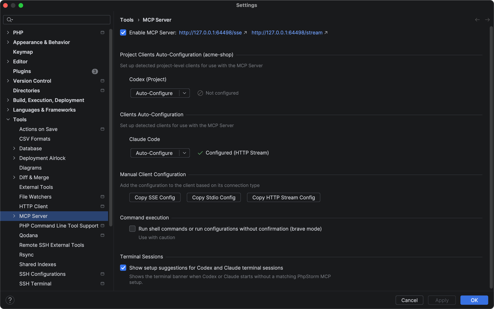
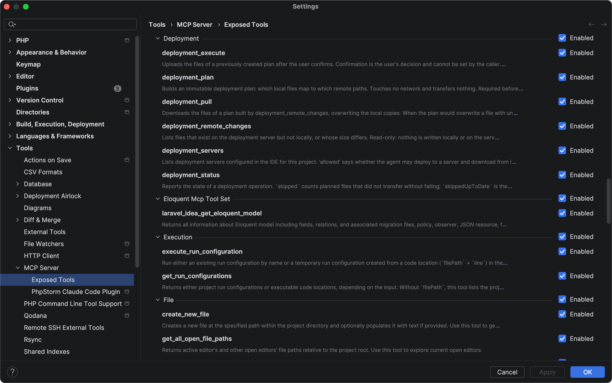

# Setting up Deployment Airlock

← Back to [Deployment Airlock](../../README.md)

Airlock adds six `deployment_*` tools to the IDE's built-in MCP server. Getting an agent to use them
takes five things: the plugin, the IDE's MCP server switched on, a Deployment server with mappings,
a client connected to the IDE, and a line in the project's agent instructions. This page walks
through them in that order and ends with what to check when something does not work.

## Install the plugin

From the JetBrains Marketplace: **Settings | Plugins | Marketplace**, search for
"Deployment Airlock", install, and restart the IDE when asked.

Until the plugin is released on the Marketplace, install it from the built zip file:
**Settings | Plugins**, the gear menu, **Install Plugin from Disk**.

Requirements:

- PhpStorm or WebStorm 2026.2 or later;
- the bundled **MCP Server** and **Deployment** plugins, both enabled. Airlock depends on them and
  does not load without them.

## Turn on the IDE's MCP server

Airlock's tools live inside the IDE's own MCP server; Airlock does not run a server of its own.
That server is **off by default**, and while it is off an agent sees none of the `deployment_*`
tools.

1. Open **Settings | Tools | MCP Server**.
2. Tick **Enable MCP Server**.
3. The IDE asks for consent in a window titled **Enable MCP Server?** — press **Enable**.
4. Press **OK** or **Apply**.

Once the server is on, its two addresses, SSE and Stream, appear next to the checkbox, and the
blocks for connecting clients appear below it: **Project Clients Auto-Configuration**, **Clients
Auto-Configuration** and **Manual Client Configuration**.



About the port:

- It is not set in the UI. Each JetBrains product has its own default; PhpStorm's is **64442**.
- If that port is taken — by another JetBrains IDE, for example — the IDE picks the next free one
  and remembers it.
- Whatever the port turns out to be, the addresses on this page show it. The screenshot above was
  taken in a sandbox IDE, hence its different port.

The server listens on `127.0.0.1` only. The IDE has to be running, with the project open, for the
tools to work.

## Set up a deployment server

Airlock does not keep servers of its own: every transfer goes through the IDE's Deployment
configuration, so the credentials stay in the IDE and the agent never sees them. If you already
upload to this server from the IDE, there is nothing to do here.

1. Open **Settings | Build, Execution, Deployment | Deployment**.
2. Add a server (SFTP, FTP and so on) and fill in its connection.
3. On the **Mappings** tab, map a local path in the project to a path on the server.
4. Optionally, make it the project's default server. An agent that does not name a server gets the
   default one.

The mapping is required. Without a mapping that covers the planned files, `deployment_plan` refuses
with `NO_MAPPING`.

To check the setup by hand, use **Tools | Deployment | Upload to…** on a file. If that works,
Airlock can use the same server.

## Connect your client

The simplest route is **Auto-Configure**, on the same **Settings | Tools | MCP Server** page. It has
two scopes:

- **Clients Auto-Configuration** sets a client up for all projects;
- **Project Clients Auto-Configuration** sets it up for one project. It lists clients only when
  Settings is opened from inside that project — opened from the Welcome screen, it shows the
  template project and stays empty.

Either works for Airlock. Press **Auto-Configure** next to your client, then restart the client.

What Auto-Configure writes: a single entry named `phpstorm` in the client's configuration file. The
other servers in that file are left alone.

| Client      | All projects            | One project                     |
| ----------- | ----------------------- | ------------------------------- |
| Claude Code | `~/.claude.json`        | `.mcp.json` in the project root |
| Codex       | `~/.codex/config.toml`  | `.codex/config.toml`            |

Claude Code is offered only when its file already exists — for `.mcp.json`, one that already has
an `mcpServers` key. Claude Code creates `~/.claude.json` the first time it runs, so run it once
before looking for it in the list. The entry written for Claude
Code looks like this:

```json
{"mcpServers": {"phpstorm": {"type": "http", "url": "http://127.0.0.1:64442/stream"}}}
```

**Manual Client Configuration** is for a client that is not in the list. **Copy SSE Config**,
**Copy Stdio Config** and **Copy HTTP Stream Config** copy a server entry to the clipboard, to be
added to the client's configuration. Unlike an Auto-Configure entry, a copied one carries the
project's path (`IJ_MCP_SERVER_PROJECT_PATH`: a header in the SSE and HTTP Stream entries, an
environment variable in the Stdio one), so it always points at that project.

**From the IDE's terminal.** When you start `claude` or `codex` in the IDE's built-in terminal and
the client is not set up yet, the IDE offers **Set up … MCP** in a banner. It switches the MCP server
on, with the same consent window, and configures the client in one click.

## Check the tools are visible

In Claude Code, run `/mcp`: the IDE's server should be listed, and its tools should include the six
`deployment_*` ones. Other clients have their own list of connected servers.

If the server is there but the tools are not, look at **Settings | Tools | MCP Server | Exposed
Tools**:

- **Exposed Tools decides what a client sees.** Unticking **Enabled** hides a tool from every
  client; the six `deployment_*` tools have to stay on. **Router-only** does nothing unless
  **Enable router-only mode** at the top of that page is on, and it is off by default. With the
  mode on, router-only tools — and every tool starts as router-only — drop out of the tool list and
  are reachable only through the IDE's `execute_tool`; an agent finds `deployment_*` there only if
  its instructions name them. Unticking Router-only on the **Deployment** group keeps all six
  visible directly.



- **Leave brave mode off.** **Run shell commands or run configurations without confirmation (brave
  mode)** on the MCP Server page removes the IDE's confirmation from its terminal and
  run-configuration tools — one of the ways around Airlock listed under
  [What Airlock does not control](how-it-works.md#what-airlock-does-not-control).

## Tell the agent

Copy [`AGENTS.template.md`](../../AGENTS.template.md) into the project's `AGENTS.md` (Codex and
others) or `CLAUDE.md` (Claude Code) and fill in its last section, **This project**.

This step is not a formality. An agent learns what the tools do from their descriptions, but
nothing in them stops it from reaching the server some other way — and an agent with a shell and
your SSH keys can. Airlock bounds its own channel; the rule in the project's instructions is what
points the agent at it.

**The agent learns about Airlock from the tool descriptions and nothing else.** When a client
connects, it asks the IDE's MCP server for its tools and gets a name, a description and a parameter
schema for each; that is what the model reads when it decides what to call. The IDE's server sends
no general instructions of its own, and Airlock, a set of tools inside it, has no place to add any.
That is why the descriptions spell out a plan's lifetime, what a refusal means and what to poll —
and why the project instructions from the template are worth adding: they are the only place that
can say "deploy this way and no other".

## Troubleshooting

| Symptom | Cause | Fix |
| --- | --- | --- |
| The client lists no IDE server, or no `deployment_*` tools | The IDE's MCP server is off | [Turn it on](#turn-on-the-ides-mcp-server) |
| The server is on in the IDE, but the client does not show it | The client was not configured, or not restarted after Auto-Configure | [Connect the client](#connect-your-client) and restart it |
| **Configured, but a port mismatch was detected – please reconfigure** next to the client | The port moved: another IDE took it, and this one picked the next free port | Press **Auto-Configure** again, then restart the client |
| The server is listed, but the `deployment_*` tools are not | They are unticked in **Exposed Tools**, or router-only mode hides them | [Check Exposed Tools](#check-the-tools-are-visible) |
| A call fails with *Unable to determine the target project for the current MCP tool call*, followed by the list of open projects | An Auto-Configure entry does not name a project. The IDE then matches the call to an open project by the working directory the client reports — Claude Code reports it — and that directory is outside every open project, or the client reports none | Start such a client inside the project's directory. For a client that reports none, use a **Copy … Config** entry, which carries the project path, or have the agent pass `projectPath`, as the message suggests |
| The same message, with an empty list of open projects | No project is open in the IDE | Open the project |
| `NO_MAPPING` | The server has no mapping in this project that covers the planned files | [Add a mapping](#set-up-a-deployment-server) |
| `SERVER_NOT_FOUND` | The agent named a server the IDE does not know, or a server group | Use a server name returned by `deployment_servers` |
| `SERVER_NOT_ALLOWED` or `PATH_NOT_ALLOWED` | **Agent scope** on the project's settings page leaves the server or the path out | Adjust [Agent scope](settings.md#agent-scope) |
| `AIRLOCK_DISABLED` | Airlock is switched off, at the IDE level or in this project | Switch it on: [Airlock](settings.md#airlock) |
| `PULL_DISABLED` | Downloading from the server is off; it can be switched on at the IDE level only | [Downloads](settings.md#downloads) |
| The agent runs terminal commands or run configurations, and the IDE does not ask first | **Run shell commands or run configurations without confirmation (brave mode)** is on | Untick it on **Settings \| Tools \| MCP Server**: [Leave brave mode off](#check-the-tools-are-visible) |
